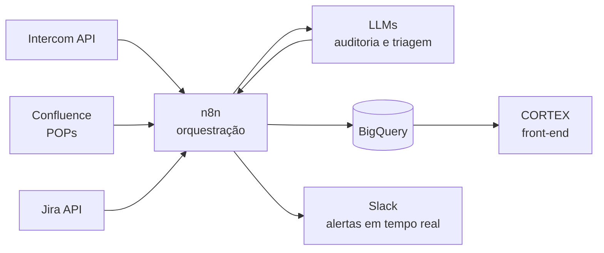

# 🚀 CORTEX · Ops Intelligence Platform

> Protótipo funcional de uma **plataforma de inteligência operacional** que centraliza, numa única interface, **qualidade de atendimento, automações, agentes de IA, reputação e gestão de tarefas**. Foi idealizado para substituir dashboards estáticos e relatórios dispersos.
> Demo com dados **fictícios**, gerados por seed determinística.

🔗 **Demo ao vivo:** https://diegorodriguesmichelsen-lab.github.io/hub-enterprise/


<!-- GIF de 15–20s: Visão Geral → busca Ctrl+K → troca de marca → um módulo de IA -->

---

## 🎯 O problema

Operações de suporte multi-marca vivem com a **informação fragmentada**:

| Fonte | Onde ficava |
|---|---|
| Qualidade / Monitoria | Power BI estático |
| CSAT, FCR, TMPR | Exportações do Intercom |
| Reputação | Painel do Reclame Aqui |
| Automações | Logs do n8n |
| Tarefas e incidentes | Jira |
| Procedimentos | Confluence |

Resultado: a liderança gastava horas consolidando dados e **não tinha uma visão única** para decidir.

## 💡 A solução

Um **hub único**, no estilo de produto SaaS, com navegação rápida e visão por marca:

| Módulo | O que mostra |
|---|---|
| **Visão Geral** | KPIs executivos: CSAT, Score de Monitoria, FCR, TMPR, Conversão, Reclame Aqui, Jira |
| **Monitoria / QA** | Auditorias, infrações, nota média e CSAT justificado |
| **Agentes de IA** | Conversas classificadas, taxa de resolução da IA e casos que **precisam de humano** (Human-in-the-Loop) |
| **Automações** | Jobs ativos, execuções/dia, taxa de sucesso (14d) e taxa de erro |
| **Custos de IA** | Consumo de **tokens** e custo total (USD/BRL), ou seja, FinOps de LLM |
| **Reputação** | Reclamações, Score RA e taxa de resolução |
| **Antifraude / Cases** | Casos ativos e acompanhamento |
| **Tarefas** | Tarefas Jira abertas e concluídas no mês |

**Recursos de UX:** busca global com **Ctrl + K**, seletor de **marca ativa** (visão multi-marca), status de sincronização e preferências persistidas em `localStorage`.

## 🏗️ Arquitetura de referência (cenário real)



> A demo pública roda **100% no front-end** com dados simulados. O diagrama mostra como a plataforma se conecta às fontes reais em produção.

| Decisão técnica | Motivo |
|---|---|
| **SPA em arquivo único** | Deploy instantâneo no GitHub Pages, sem servidor e sem build |
| **Dados por PRNG com seed (Mulberry32)** | Demo reprodutível e segura, sem dados reais |
| **Painel de custos de tokens** | Em IA de produção, custo é métrica de primeira classe |
| **Indicador "Precisam de humano"** | Arquitetura **Human-in-the-Loop**: a IA decide sozinha só acima de um limiar de confiança |

## 🧰 Stack

**Demo:** `HTML5` · `CSS3` · `JavaScript (ES6+)` · `ApexCharts` · `GitHub Pages`
**Ecossistema real:** `n8n` · `REST APIs` · `Webhooks` · `LLMs (OpenAI, Claude)` · `BigQuery/SQL` · `Intercom` · `Jira` · `Confluence` · `Slack`

## 📈 Resultados no projeto real

- Auditoria de **~10% para 90–100%** dos atendimentos (**+8 mil auditados**)
- **40h para 8h/semana** de esforço manual (**-80%**)
- **+15% no CSAT**
- **3 marcas** unificadas; uma nova marca foi absorvida **sem retrabalho**
- Feedback automatizado para **12 analistas**, com **alertas em tempo real** para infrações críticas

## ▶️ Como rodar

```bash
git clone https://github.com/diegorodriguesmichelsen-lab/hub-enterprise.git
cd hub-enterprise
# abra o index.html no navegador
```

## 🗺️ Roadmap

- [ ] Conectar a uma API mock (JSON) para simular a integração real
- [ ] Publicar um workflow n8n de exemplo (sanitizado) em `/workflows`
- [ ] Testes dos cálculos de KPIs

---

**Diego Michelsen** · Automação de Processos & IA
[LinkedIn](https://www.linkedin.com/in/diegomichelsen) · [Monitoria QA](https://diegorodriguesmichelsen-lab.github.io/monitoria/)
